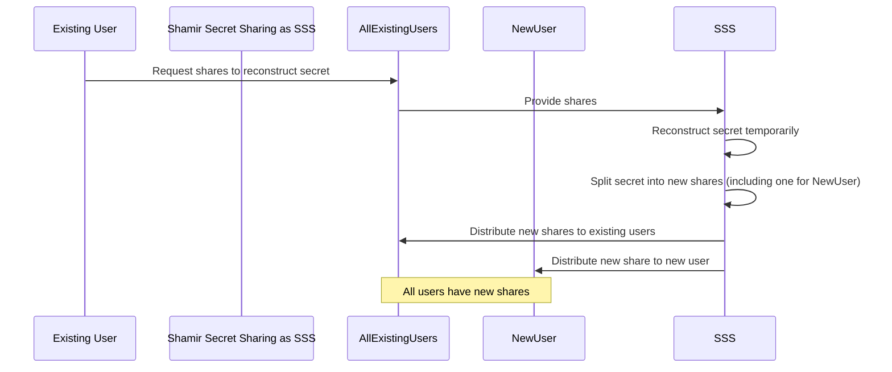
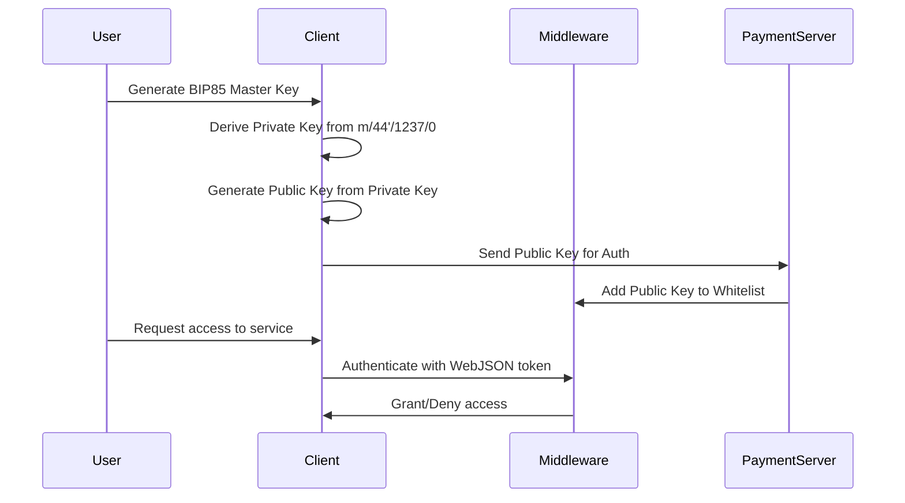
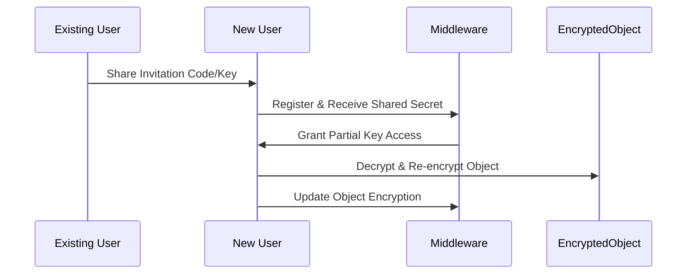
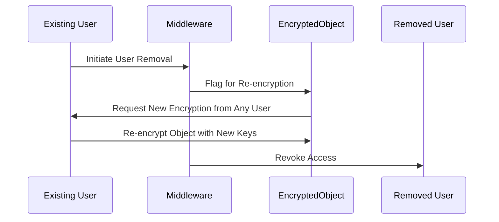

# Technical Proposal: Trustless Cryptographic System
## Introduction
Trust minimised cryptographic system leveraging hierarchical deterministic wallets following Bitcoin Improvement Proposal 85 (BIP85) to create a secure, scalable, and efficient method of user authentication and encrypted object management. This system is designed to allow users to generate cryptographic keys, manage access, and securely communicate with a middleware server and a payment server, all without the need to trust these servers with their private keys.

## System Overview
Goal: To develop a trustless system where users can generate their cryptographic keys, authenticate with servers, and manage encrypted objects with flexible user addition and removal, without any keys ever being traded on the server.
Technology Stack: JavaScript, with specific libraries like bitcoinjs-lib, bcoin, Web Cryptography API, and TweetNaCl.js.
Architecture: Client-side cryptographic operations, server-side whitelist management, and encrypted object handling using a Secret Sharing Scheme.
Detailed Workflow
User Key Generation
BIP85 Master Key: Each user generates a master key based on BIP85.
Derivation Path: Using m/44'/1237/0 for ID authentication with the server.
Key Pair Generation: The client generates a 32-byte private key and derives the public key.
Public Key Registration
Authentication: The public key is used as part of a WebJSON token for server authentication.
Whitelist Management: The public key is added to the server-side whitelist managed by the middleware server.
Secure Communication
HTTPS Protocol: All communication between the client and servers is secured using HTTPS to prevent man-in-the-middle attacks.
Trustless Model: All cryptographic operations are performed client-side, ensuring no sensitive data is handled by the server.
Encrypted Object Management
Creation: A user can create an encrypted object and share access using a Secret Sharing Scheme.
User Addition: New users can be invited by sharing a code or key, allowing them to decrypt and re-encrypt the object.
User Removal: When a user is removed, the object needs to be re-encrypted with new keys.
## Sequence Diagrams
The technical workflow is visualized in three sequence diagrams representing initial key distribution, user addition, and user removal. These diagrams provide a step-by-step breakdown of the interactions between the users, clients, middleware, and servers.

Technology Choices
JavaScript Libraries
bitcoinjs-lib: For comprehensive Bitcoin-related features, including Taproot.
bcoin: As an extensible full node or SPV node, with potential Taproot support.
Web Cryptography API: For a variety of cryptographic operations needed in the system.
TweetNaCl.js: For a lightweight option for encryption and decryption.
Considerations
Trustless Architecture: Ensuring all cryptographic operations are client-side.
Performance: Balancing between cryptographic security and system performance.
Scalability: Efficient handling of key distribution and encrypted object management as the number of users grows.
Implementation Plan
Library Assessment: Evaluate and select the most suitable JavaScript libraries.
Prototype Development: Develop a prototype focusing on key generation, registration, and object management.
Security Review: Conduct thorough security assessments at each stage of development.

Initial Key Distribution
This diagram illustrates how users generate their keys and register their public keys with the middleware and payment servers initially.

User Addition
This diagram shows how an existing user can invite a new user by sharing a code or key, allowing the new user to join and decrypt/re-encrypt the object.

User Removal
This diagram represents the process when one of the users is removed, necessitating the re-encryption of the shared object with a new set of keys.

